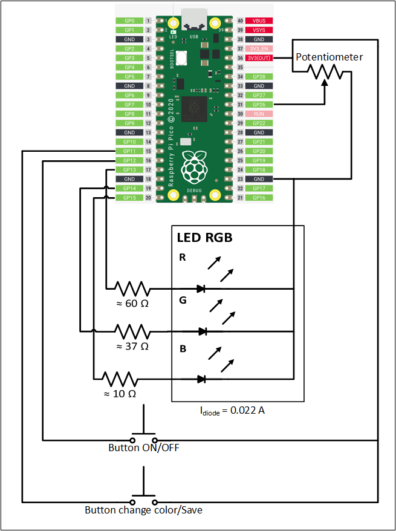

# Simple program written in MicroPython for RGB led color change

## Tools

1. MicroPython
2. Microcontroller: raspberry pi pico (RP2040)

## Video with an example of operating the device

https://user-images.githubusercontent.com/71873238/204652224-ee3208d4-c521-40b6-9d87-61d3b26293b4.mp4

## Circuit diagram
